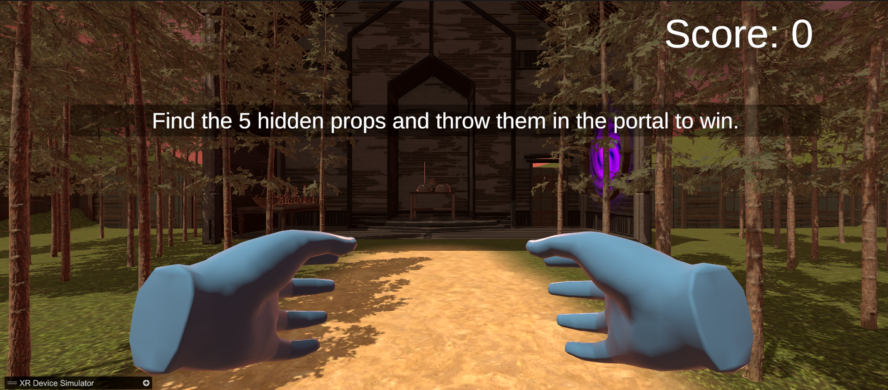

# Prop Hunt VR

### Assignment Objective
To create a basic VR game with a virtual environment in Unity that includes a ground plane, a skybox, environmental objects, lighting and simple VR interaction. The player should be able to grab and move the grabbable objects in the environment to score points.

### Links
To avoid downloading,

Demo video: [Google Drive Link](https://drive.google.com/file/d/1ROAnroI55tlKpfVKKytL-QcZ6VkYP1iZ/view?usp=sharing) <br>
Documentation: [Google Docs Link](https://docs.google.com/document/d/1uagwSp_-LHBlPXFXXTMxM-Dn65ZTm0be/edit?usp=sharing&ouid=107669018655189085086&rtpof=true&sd=true)

### Setup

- Clone this repository.

``` 
git clone https://github.com/aditdesai/Prop-Hunt-VR.git 
```

- Open Unity Hub and add the cloned project from disk (for seamless setup, make sure your Unity version is 2022.3.29f1 LTS)
- Once loaded, simply hit play if you want to test on your PC. Otherwise, delete XR Device Simulator from hierarchy and build the game from Build Settings. Make sure to switch to the appropriate platform.

### Screenshots



